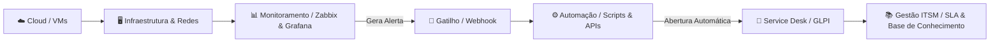

<div align="center">

# 👋 Olá, eu sou Tarsis Pereira

### **Analista de TI | Infraestrutura | Service Desk | Monitoramento | Automação**

<p align="center">
  <a href="https://www.linkedin.com/in/tarsisprdefarias/" target="_blank">
    
  </a>
  <a href="https://github.com/TARSISP" target="_blank">
    
  </a>
  <a href="mailto:tarsis2346@gmail.com">
    
  </a>
</p>

> *"Profissional de tecnologia focado em infraestrutura, suporte, monitoramento e automação de ambientes de TI. Gosto de transformar problemas operacionais em processos, ferramentas e soluções que aumentam a disponibilidade e a eficiência da operação."*

---

<!-- Typing SVG para dinamismo visual profissional -->
<a href="https://git.io/typing-svg">
  
</a>

</div>

<br />

---

## 🚀 Sobre Mim

Atuo na área de Tecnologia da Informação com foco em **sustentação de infraestrutura**, **suporte técnico corporativo (Service Desk)**, **monitoramento proativo de serviços** e **automação de rotinas operacionais**.

Com vivência prática na administração de ambientes híbridos (**Linux e Windows Server**), redes corporativas e plataformas de ITSM, meu objetivo diário é garantir alta disponibilidade dos sistemas e reduzir o tempo médio de atendimento e resolução (MTTR). 

Tenho perfil **Hands-on**: pesquiso, projeto, implemento, testo, monitoro e documento cada solução desenvolvida.

### 🔄 Mentalidade Operacional:
```text
Monitorar ──▶ Detectar ──▶ Diagnosticar ──▶ Automatizar ──▶ Resolver ──▶ Documentar
```

- **Foco no negócio:** Suporte de TI ágil com foco na continuidade dos processos operacionais.
- **Prevenção > Reação:** Alertas calibrados para antecipar falhas antes que impactem o usuário final.
- **Eficiência:** Troca de processos manuais e repetitivos por scripts de automação robustos e auditáveis.

<br />

---

## 🏗️ Arquitetura Operacional Integrada

Abaixo está o modelo conceitual que orienta a arquitetura de soluções e operações que desenvolvo:



<details>
<summary><b>Visualizar em formato textual estruturado</b></summary>

```text
☁️ CLOUD (GCP / VMs)
   │
   ▼
🖥️ INFRAESTRUTURA (Linux / Windows / Redes)
   │
   ▼
📊 MONITORAMENTO (Zabbix / Grafana / Agentes)
   │
   ▼
🚨 ALERTA (Triggers / Eventos / Limiares)
   │
   ▼
⚙️ AUTOMAÇÃO (Python / PowerShell / Bash / Webhooks)
   │
   ▼
🎫 SERVICE DESK (GLPI / Abertura & Roteamento de Chamados)
   │
   ▼
📚 ITSM (SLA / Gestão de Incidentes / Base de Conhecimento)
```
</details>

<br />

---

## 🛠️ Tecnologias & Ferramentas

Organização do ecossistema técnico aplicado em projetos e operações reais:

### 💻 Sistemas Operacionais & Ambientes


* **Linux / Ubuntu / Debian:** Administração de pacotes, serviços (`systemd`), usuários, permissões, agendamento de rotinas (`cron`) e deploy de aplicações.
* **Windows & Windows Server:** Gerenciamento corporativo, serviços de rede, troubleshooting de estações de trabalho e servidores.

### ☁️ Cloud & Infraestrutura


* Provisionamento de instâncias virtuais (VMs), configuração de regras de firewall, conectividade VPC e sustentação de serviços na nuvem Google Cloud.

### 📊 Monitoramento & Observabilidade


* Configuração de agentes Zabbix, criação de templates de coleta, triggers inteligentes, métricas de hardware/serviços e dashboards visuais no Grafana para tomada de decisão.

### 🎫 ITSM & Service Desk


* Gestão de incidentes e requisições, controle de catálogo de serviços, cumprimento de SLA, estruturação de Base de Conhecimento e integração via Webhooks/APIs.

### ⚙️ Automação & Scripting


* Scripts para automação de tarefas manuais, pipelines de integração, testes automatizados e integração de sistemas via requisições REST/JSON.

### 🌐 Redes & Conectividade


* Diagnóstico e resolução de problemas de camada de rede, rotas, resolução de nomes (DNS), regras de firewall e testes de conectividade de portas.

### 🐳 Containers & Banco de Dados


* Empacotamento de ferramentas e serviços em containers isolados, orquestração local com Docker Compose e gerenciamento de bancos relacionais.

### 🔧 Desenvolvimento & Apoio Operacional


* Construção de dashboards, ferramentas internas de apoio a equipes de campo e APIs utilitárias.

> **Classificação de Maturidade Técnica:**  
> 🟢 **Prática Operacional / Produção:** Linux, Windows/Server, Service Desk/ITSM, GLPI, Zabbix, Redes, PowerShell, Bash, Hardware.  
> 🟡 **Projetos Práticos Aplicados:** Google Cloud (GCP), Grafana, Docker, Python, PostgreSQL, MySQL, REST APIs.  
> 🔵 **Em Desenvolvimento Contínuo:** TypeScript, Node.js, React, CI/CD Avançado, Práticas DevOps/SRE.

<br />

---

## 🚀 Projetos em Destaque

Soluções desenvolvidas com foco em problemas reais de infraestrutura, automação e observabilidade:

<table>
  <tr>
    <td width="50%" valign="top">
      <h3>☁️ 01. Cloud Service Monitor</h3>
      <p><b>Monitoramento e telemetria de serviços executados em VM do Google Cloud.</b></p>
      <ul>
        <li><b>Problema:</b> Acompanhar a saúde operacional de uma VM Linux na nuvem sem depender de ferramentas pesadas.</li>
        <li><b>Recursos:</b> Agente Linux coletor de CPU, RAM, Disco, Rede e Uptime; verificação de portas e endpoints HTTP/HTTPS; alertas e dashboard web responsivo.</li>
        <li><b>Stack:</b> <code>GCP</code> • <code>Linux</code> • <code>Docker</code> • <code>Node.js</code> • <code>React</code> • <code>PostgreSQL</code> • <code>REST API</code></li>
      </ul>
      <p>🔗 <a href="https://github.com/TARSISP/cloud-service-monitor"><b>Ver Repositório ➔</b></a></p>
    </td>
    <td width="50%" valign="top">
      <h3>🎫 02. GLPI + Zabbix Automation</h3>
      <p><b>Integração automatizada entre observabilidade de infraestrutura e Service Desk.</b></p>
      <ul>
        <li><b>Problema:</b> Atraso na abertura manual de chamados críticos gerados por incidentes de infraestrutura.</li>
        <li><b>Recursos:</b> Triggers do Zabbix disparam Webhooks que interagem com a API REST do GLPI, criando automaticamente o ticket com detalhes técnicos e atualizando o status na normalização.</li>
        <li><b>Stack:</b> <code>Zabbix</code> • <code>GLPI API</code> • <code>Python</code> • <code>Webhooks</code> • <code>Docker</code></li>
      </ul>
      <p>🔗 <a href="https://github.com/TARSISP/glpi-zabbix-automation"><b>Ver Repositório ➔</b></a></p>
    </td>
  </tr>
  <tr>
    <td width="50%" valign="top">
      <h3>🧰 03. Service Desk Toolkit</h3>
      <p><b>Suíte de utilitários e diagnósticos para técnicos de Service Desk e suporte de campo.</b></p>
      <ul>
        <li><b>Problema:</b> Tempo excessivo para coleta manual de dados técnicos de estações de trabalho e testes de rede.</li>
        <li><b>Recursos:</b> Teste automatizado de DNS, ping, rotas, verificação de serviços essenciais, limpeza segura de temporários e relatório unificado do hardware.</li>
        <li><b>Stack:</b> <code>PowerShell</code> • <code>Bash</code> • <code>Batch</code> • <code>Windows & Linux</code></li>
      </ul>
      <p>🔗 <a href="https://github.com/TARSISP/service-desk-toolkit"><b>Ver Repositório ➔</b></a></p>
    </td>
    <td width="50%" valign="top">
      <h3>📊 04. Infrastructure Monitoring Lab</h3>
      <p><b>Laboratório completo de observabilidade de infraestrutura local e em nuvem.</b></p>
      <ul>
        <li><b>Problema:</b> Falta de visibilidade centralizada sobre o consumo de recursos de múltiplos servidores.</li>
        <li><b>Recursos:</b> Deploy via Docker Compose contendo Zabbix Server, Frontend web, PostgreSQL e Grafana provisionados com dashboards integrados.</li>
        <li><b>Stack:</b> <code>Zabbix</code> • <code>Grafana</code> • <code>Docker Compose</code> • <code>PostgreSQL</code> • <code>Linux</code></li>
      </ul>
      <p>🔗 <a href="https://github.com/TARSISP/infrastructure-monitoring"><b>Ver Repositório ➔</b></a></p>
    </td>
  </tr>
  <tr>
    <td colspan="2" valign="top">
      <h3>⚙️ 05. IT Automation Lab</h3>
      <p><b>Ambiente de testes para automação de tarefas rotineiras de Tecnologia da Informação.</b></p>
      <ul>
        <li><b>Problema:</b> Rotinas diárias manuais de backup, verificação de integridade e checagem de certificados com alta probabilidade de erro humano.</li>
        <li><b>Recursos:</b> Scripts modulares em Python/PowerShell/Bash executados via triggers ou GitHub Actions para testes contínuos e alertas automáticos.</li>
        <li><b>Stack:</b> <code>Python</code> • <code>PowerShell</code> • <code>Bash</code> • <code>GitHub Actions</code> • <code>Docker</code> • <code>APIs</code></li>
      </ul>
      <p>🔗 <a href="https://github.com/TARSISP/it-automation-lab"><b>Ver Repositório ➔</b></a></p>
    </td>
  </tr>
</table>

<br />

---

## 💡 Meu Foco: Problemas Reais

Minha atuação é guiada pela entrega de valor operacional tangível:

* ⚡ **Automatizar tarefas repetitivas:** Deixar que scripts executem o trabalho rotineiro para focar em melhorias estruturais.
* ⏱️ **Reduzir o tempo de diagnóstico (MTTR):** Centralizar métricas e logs para identificar a causa-raiz de incidentes em minutos.
* 📈 **Melhorar a observabilidade:** Substituir suposições por métricas claras de desempenho e capacidade.
* 🛡️ **Aumentar a disponibilidade:** Detectar falhas incipientes antes do impacto em operações produtivas.
* 🔄 **Transformar alertas em ações:** Notificações devem conter contexto e direcionamento para a equipe de atendimento.
* 📋 **Transformar problemas em processos:** Um incidente resolvido deve gerar documentação, procedimento ou base de conhecimento.
* 🤖 **Transformar processos em automação:** Todo procedimento operacional estável é candidato a se tornar código.

<br />

---

## 🎯 Atualmente Estudando

Dedico parte constante da minha rotina ao aprimoramento técnico contínuo nas seguintes frentes:

* ☁️ **Cloud Architecture:** Boas práticas de conectividade, segurança e escalabilidade na Google Cloud Platform (GCP).
* 🔄 **Cultura DevOps & SRE:** Pipelines de integração contínua (CI/CD), gerenciamento de configuração e confiabilidade de sistemas.
* 🔭 **Observabilidade Avançada:** Criação de alertas baseados em desvios de métricas e visualizações analíticas no Grafana.
* 🐳 **Containers & Orquestração:** Conteinerização de ferramentas corporativas e gerenciamento ágil de serviços.
* 🐍 **Programação Aplicada à Infraestrutura:** Automações avançadas com Python e integração com APIs de serviços em nuvem.
* 🛡️ **Segurança Defensiva de Infraestrutura:** Hardening básico de sistemas Linux/Windows e gestão segura de acessos e credenciais.

<br />

---

## 📊 GitHub Analytics & Atividade

<div align="center">
  <table border="0">
    <tr>
      <td>
        
      </td>
      <td>
        
      </td>
    </tr>
  </table>
  
  <p align="center">
    
  </p>
</div>

<br />

---

## 📫 Vamos Conversar?

Estou à disposição para discutir sobre infraestrutura, suporte corporativo, monitoramento, automações e novas oportunidades na área de TI:

<p align="center">
  <a href="https://www.linkedin.com/in/tarsisprdefarias/" target="_blank">
    
  </a>
  &nbsp;&nbsp;&nbsp;
  <a href="https://github.com/TARSISP" target="_blank">
    
  </a>
  &nbsp;&nbsp;&nbsp;
  <a href="mailto:tarsis2346@gmail.com">
    
  </a>
</p>

<br />

<div align="center">
  <sub>Desenvolvido com foco em boas práticas de engenharia de infraestrutura, clareza operacional e automação.</sub>
</div>
